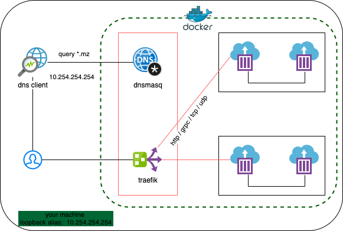
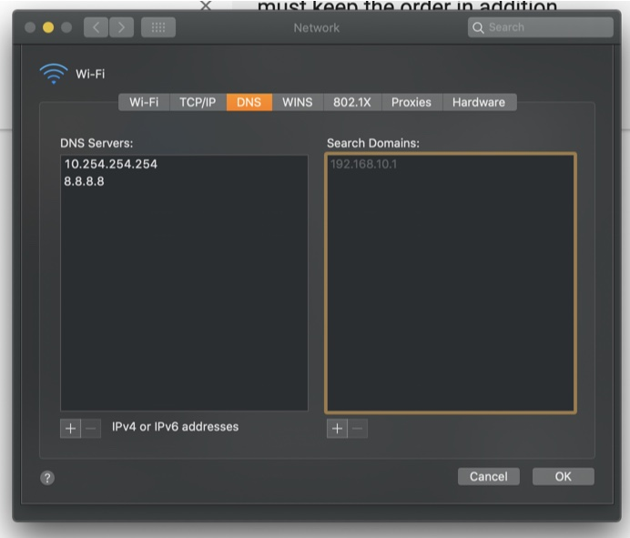

# Setup Development Network



## Quick Startup Guide

1. Create a fixed loopback alias IP
2. Install a self-signed SSL certificate into your machine trust-store
3. Create a dedicated docker proxy-network
4. docker-compose up to run the proxy
5. Active your private DNS (10.254.254.254)
6. Test
7. Setup Docker Volume sync for MacOS

## 1. Setup Loopback Alias IP

### Ubuntu

```bash
export MY_IP="10.254.254.254"

ip addr add $MY_IP/24 dev lo

cp -f /etc/netplan/01-network-manager-all.yaml /etc/netplan/01-network-manager-all.yaml.bak

cat <<EOF > /etc/netplan/01-network-manager-all.yaml
# Let NetworkManager manage all devices on this system
network:
  version: 2
  renderer: NetworkManager
  ethernets:
    lo:
      renderer: networkd
      match:
        name: lo
      addresses:
        - $MY_IP/24
EOF
```

### MacOS

```bash
export MY_IP="10.254.254.254"

sudo ifconfig lo0 alias $MY_IP
```

Problems is that this doesn’t persist across reboots. To make it persist across reboots, one can create a “launchd” daemon that configures this additional IPv4 address. Something like this:

```bash
$ cat << EOF | sudo tee -a /Library/LaunchDaemons/com.mystation.loopback1.plist
<?xml version="1.0" encoding="UTF-8"?>
<!DOCTYPE plist PUBLIC "-//Apple//DTD PLIST 1.0//EN" "http://www.apple.com/DTDs/PropertyList-1.0.dtd">
<plist version="1.0">
  <dict>
    <key>Label</key>
    <string>com.felipe-alfaro.loopback1</string>
    <key>ProgramArguments</key>
    <array>
        <string>/sbin/ifconfig</string>
        <string>lo0</string>
        <string>alias</string>
        <string>$MY_IP</string>
    </array>
    <key>RunAtLoad</key>
    <true/>
  </dict>
</plist>
EOF
```

Then, start the service:

```bash
$ sudo launchctl load /Library/LaunchDaemons/com.mystation.loopback1.plist
```

And make sure it did work:

```bash
$ sudo launchctl list | grep com.mystation

-   0   com.mystation.loopback1

$ ifconfig lo0

lo0: flags=8049<UP,LOOPBACK,RUNNING,MULTICAST> mtu 16384
    options=1203<RXCSUM,TXCSUM,TXSTATUS,SW_TIMESTAMP>
    inet 127.0.0.1 netmask 0xff000000
    inet6 ::1 prefixlen 128
    inet6 fe80::1%lo0 prefixlen 64 scopeid 0x1
    inet 127.0.1.1 netmask 0xff000000
    nd6 options=201<PERFORMNUD,DAD>

```

## 2. Install self-signed SSL CARoot (Root Certificate Authority) to your trust-store

### Linux / Ubuntu

```bash
cd etc/traefik/certs
./mkcert_linux_install.sh
```

### MacOS

```bash
brew install mkcert

cd etc/traefik/certs
export CAROOT=$(pwd)
mkcert -install
```

- currently there are some basic configuration available, if you want to custom please read the instructions at `etc/traefik/certs/README.md`

## 3. Create dedicated proxy network

```
docker network create --driver=bridge --subnet=172.21.0.0/16 --gateway=172.21.0.1 https-proxy
```

## 4. Active your private DNS

### Ubuntu

- disable systemd-resolved DNS
- your private DNS will listen at the same port
- this step will make your system un-responsible

```bash
sudo sed -e "s/^#\?DNS=.*/DNS=10.254.254.254/g" -i /etc/systemd/resolved.conf
sudo sed -e "s/^#\?Domains=.*/Domains=~me/g" -i /etc/systemd/resolved.conf

sudo systemctl restart systemd-resolved.service
```

### MacOS

- open `system preferences -> network -> advanced... (button) -> DNS (tab)`
- add `10.254.254.254` and `8.8.8.8` to DNS Server (must keep the order in addition)



## 5. Run the dev-networks

```bash
docker-compose up -d
```

## 6. Test

### DNS Test

Try ping to `abc.COMPANY.mz` or `xyz.COMPANY.mz` . If there is any response from ip 10.254.254.254 , your setup is working properly

### Traefik forwarding test

```bash

docker-compose -f whoami.yml up

```

Open browser then check following domains

- `traefik.dev.mz`
- `whoamia.dev.mz`
- `whoamib.dev.mz`

## 7. Setup Docker Volume Sync & common bash utils for MacOS

```bash

  # install common bash utils
  brew install coreutils

  # make ready for mutagen sync if needed
  brew install mutagen-io/mutagen/mutagen

  # setup proper nfs permission
  ./setup_native_nfs_docker_osx.sh

```

### Setup Mutagen sync if needed (MacOS only)

https://mutagen.io/documentation/introduction

```bash

  # make ready for mutagen sync if needed
  brew install mutagen-io/mutagen/mutagen

  mutagen daemon register

  mutagen daemon start

```
